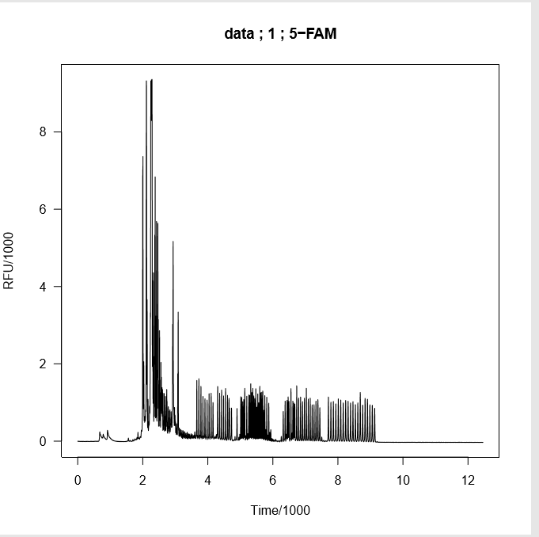
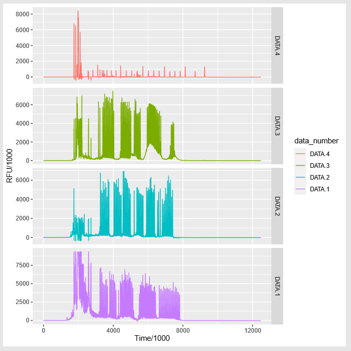
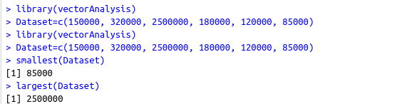
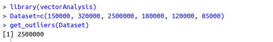
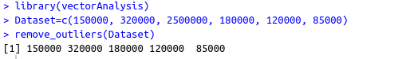
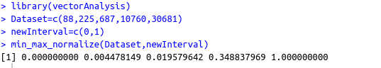
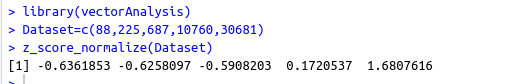
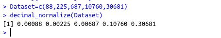

# Tests-for-the-project-MCMC-for-Forensic-Science-R-Projects-GSOC-2020

## 1. Easy Test

### Problem Statement

Download data from [https://lftdi.camden.rutgers.edu/provedit/files/](https://lftdi.camden.rutgers.edu/provedit/files/) then use `seqinr::read.abif` to read and `seqinr::plotabif` to plot an fsa file.

First, I downloaded data from the given link. Then I installed the current version of `seqinr` package, which is used for biological sequences retrieval and analysis. In the following code, I used `seqinr::read.abif()` to read the fsa file(data) and then I plot the data extracted using `seqinr::plotabif()`.

### Code
```
#loading the required packages

library(seqinr)

#reading fsa file using read.abif()

data<-read.abif("A01-Ladder-PP16-001.5sec.fsa")

#Data plotting

plotabif(data)
```
### Plot


## 2. Medium Test

### Problem Statement

To make a similar multi-panel ggplot with `facet_grid`.

### Code

```
#Add your dataframes here
dataframes_found_in_system=c("DATA.1","DATA.2","DATA.3","DATA.4")
#loading the required packages

library(seqinr)
library(ggplot2)

#reading fsa file using read.abif() and taking data portion only

data<-read.abif("A01-Ladder-PP16-001.20sec.fsa")$Data

#Data plotting


dataframes=NULL
i=length(dataframes_found_in_system)

#while there is dataframe take it and bind it with previous dataframes
while(i!=0)
{
time<-c(1:length(data[[dataframes_found_in_system[i]]]))
data_number<-rep(dataframes_found_in_system[i],length(data[[dataframes_found_in_system[i]]]))
value<-data[[dataframes_found_in_system[i]]]
temp<-data.frame(time,data_number,value)
dataframes=rbind(dataframes,temp)
i=i-1
}


#plotting multi-panel ggplot with facet_grid
ggplot(data = dataframes,group=data_number,aes(color=data_number)) +
  geom_line(data = dataframes,aes(x=time,y=value))+facet_grid(data_number~.,scales = "free")+
  scale_x_continuous(name = "Time/1000")+scale_y_continuous(name = "RFU/1000")
  ```
  
### Plot




## 3. Hard Test

### Problem Statement

Demonstrate your capability in one of the "Bayesian packages for general model fitting" listed here: [https://cloud.r-project.org/web/views/Bayesian.html](https://cloud.r-project.org/web/views/Bayesian.html), or in writing an R package with C++ code.

I have created R packages using C++. This packages operates on R vectors .It have 7 operations:

smallest:Get minmum element in vector.
largest:Get maximum element in vector.
get_outliers:Return outliers in vector.
remove_outliers:Return input vector but without outliers.
min_max_normalize:Normalize input vector accoring to min max interval
z_score_normalize:N
decimal_normalize

### Code

#### `vectorAnalysis` Package

##### C++ File code
```
#include<RcppArmadillo.h>
#include<algorithm>
#include<math.h>
// [[Rcpp::depends(RcppArmadillo)]]
using namespace Rcpp ;

// [[Rcpp::export()]]
double min_in_vector(Rcpp::NumericVector input){
  Rcpp::NumericVector temp(input.begin(),input.end());
  std::sort(temp.begin(),temp.end());
  return temp[0];
}

// [[Rcpp::export()]]
double max_in_vector(Rcpp::NumericVector input){
  Rcpp::NumericVector temp(input.begin(),input.end());
  std::sort(temp.begin(),temp.end());
  return temp[input.size()-1];
}


  // [[Rcpp::export()]]
Rcpp::NumericVector get_outliers_vector(Rcpp::NumericVector data){
    Rcpp::NumericVector temp(data.begin(),data.end());
    std::sort(temp.begin(),temp.end());
    Rcpp::NumericVector outliers;
    double Q1,Q3;
    double compare1,compare2;
    long long mid;
    mid=data.size()/2;
    if(data.size()%2==0)
    {
      //get compare1
      Q1=(temp[mid/2]);
      //get compare2
      Q3=(temp[mid+mid/2]);
    }
    else
    {
      if(mid%2==0)
      {
        Q1=(temp[mid/2]+temp[(mid/2)-1])/2.0;
        Q3=(temp[mid+mid/2]+temp[mid+(mid/2)+1])/2.0;
      }
      else
      {
          Q1=-1.5*(temp[mid/2]);
          Q3=1.5*(temp[mid+mid/2+1]);
      }
    }
    //std::cout<<Q1<<std::endl<<Q3;

    compare1=Q1-1.5*(Q3-Q1);
    compare2=Q3+1.5*(Q3-Q1);
    //std::cout<<compare1<<std::endl<<compare2;
    for(long long i=0;i<data.size();i++)
      if(data[i]<compare1||data[i]>compare2)outliers.push_back(data[i]);

      return outliers;
  }


// [[Rcpp::export()]]
Rcpp::NumericVector remove_outliers_vector(Rcpp::NumericVector data){
  Rcpp::NumericVector temp(data.begin(),data.end());
  std::sort(temp.begin(),temp.end());
  Rcpp::NumericVector NoOutliers;
  double compare1,compare2;
  long long mid;
  mid=data.size()/2;
  if(data.size()%2==0)
  {
    //get compare1
    compare1=-1.5*(temp[mid/2]);
    //get compare2
    compare2=1.5*(temp[mid+mid/2]);
  }
  else
  {
    if(mid%2==0)
    {
      compare1=-1.5*(temp[mid/2]+temp[(mid/2)-1]);
      compare2=1.5*(temp[mid+mid/2]+temp[mid+(mid/2)+1]);
    }
    else
    {
      compare1=-1.5*(temp[mid/2]);
      compare2=1.5*(temp[mid+mid/2+1]);
    }
  }
  for(long long i=0;i<data.size();i++)
    if(data[i]<compare1||data[i]>compare2);
    else NoOutliers.push_back(data[i]);

    return NoOutliers;
}

// [[Rcpp::export()]]
Rcpp::NumericVector min_max_normalize(Rcpp::NumericVector data,Rcpp::NumericVector newMin_newMax){
double oldMin=min_in_vector(data);
double oldMax=max_in_vector(data);
double newMin=newMin_newMax[0];
double newMax=newMin_newMax[1];
double exp1=oldMax-oldMin;
double exp2=newMax-newMin;

for(long long i=0;i<data.size();i++){
  data[i]=(data[i]-oldMin)/(exp1);
  data[i]*=exp2;
  data[i]+=newMin;
}
return data;
}

// [[Rcpp::export()]]
Rcpp::NumericVector z_score_normalize(Rcpp::NumericVector data){
  double mean=0,sigma=0;
  for(long long i=0;i<data.size();i++)
    mean+=data[i];
  mean/=(double)data.size();
  for(long long i=0;i<data.size();i++)
    sigma+=pow(data[i]-mean,2.0);
  sigma/=(data.size()-1);
  sigma=sqrt(sigma);

  for(long long i=0;i<data.size();i++)
    data[i]=(data[i]-mean)/sigma;

    return data;
  }


// [[Rcpp::export()]]
Rcpp::NumericVector decimal_normalize(Rcpp::NumericVector data){
  long long max_in_data_integer_part=(long long)(max_in_vector(data));
  long long digits=0;
 while(max_in_data_integer_part)
 {
   max_in_data_integer_part/=10;
   digits+=1;
 }
 //std::cout<<digits;
  double divide=pow(10.0,digits);
  for(int i=0;i<data.size();i++)
  {
    data[i]/=divide;
  }
  return data;
}

```
##### R file Code
```
#' smallest
#'
#' function to get minumum element in R vector.
#' @param input input vector
#'
#' @return minumum number
#' @export
#'
#' @examples
#' v=c(10,50,5,3)
#' smallest(v)
#'
#' 3
smallest<- function(input){
  res<- min_in_vector(input)
  res
}

#' largest
#'
#' function to get maximum element in R vector.
#' @param input input vector
#'
#' @return maximum number
#' @export
#'
#' @examples
#' v=c(10,50,5,3)
#' smallest(v)
#'
#' 50
largest<- function(input){
  res<- max_in_vector(input)
  res
}

#' get_outliers
#'
#' function to get outliers in a vector
#' @param data input vector
#'
#' @return outliers in a vector
#' @export
#'
#' @examples
#'
get_outliers <-function(data){
  outliers<-get_outliers_vector(data)
  if(length(outliers))
    outliers
  else "No outliers"
}


#' remove_outliers
#'
#' function to remove outliers from a vector
#' @param data input vector
#'
#' @return vector without outliers
#' @export
#'
#' @examples
#'
remove_outliers <-function(data){
  res<-remove_outliers_vector(data)
  res
}

#' normalize_min_max
#'
#'function to normalize data between some range(newMin,newMax)
#' @param data input vector
#' @param newMin_newMax vector contains 2 values only newMin and newMax which is your new range to normalize data
#'
#' @return normalized vector
#' @export
#'
#' @examples
normalize_min_max <-function(data,newMin_newMax)
{
  res<-min_max_normalize(data,newMin_newMax)
  res
}

#' normalize_z_score
#'
#'function to normalize vector according to z-score
#' @param data input vector
#'
#' @return normalized vector
#' @export
#'
#' @examples
normalize_z_score <-function(data)
{
  res<-z_score_normalize(data)
  res
}


#' normalize_decimal
#'
#'function to normalize vector according to largest number digits newNumber=oldNumber/10^digits where digits is largest number digits
#
#' @param data input vector
#'
#' @return normalized vector
#' @export
#'
#' @examples
normalize_decimal <-function(data)
{
  res<-decimal_normalize(data)
  res
}

```

### output images

smallest-largest Example:



get_outliers Example:

!

remove_outliers Example:

!

min_max_normalize Example:

!

z_score_normalize Example:

!

decimal_normalize Example:

!

### Last notes 

